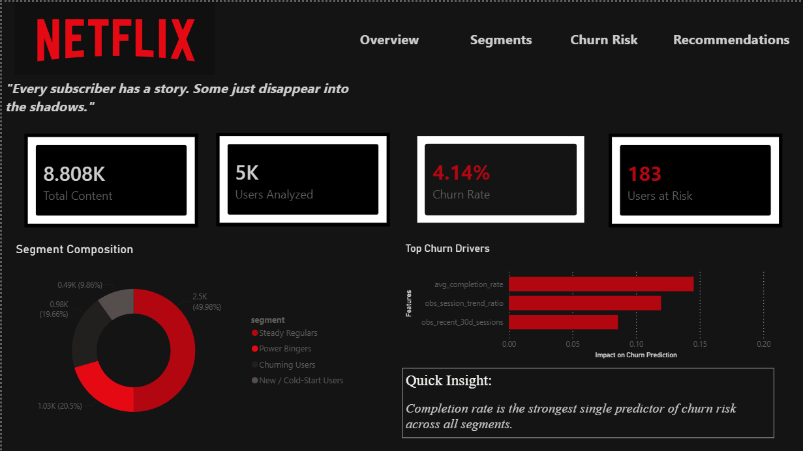
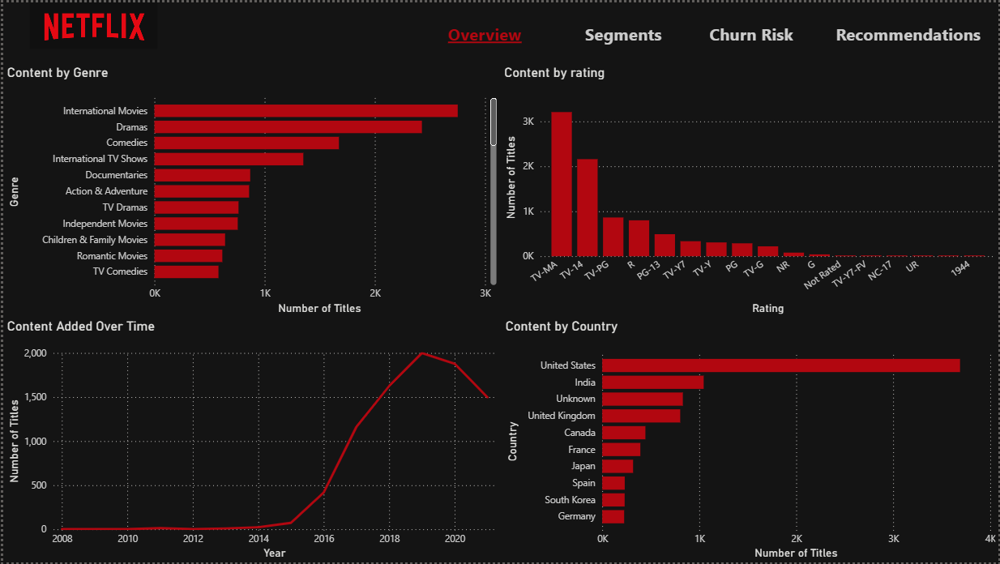
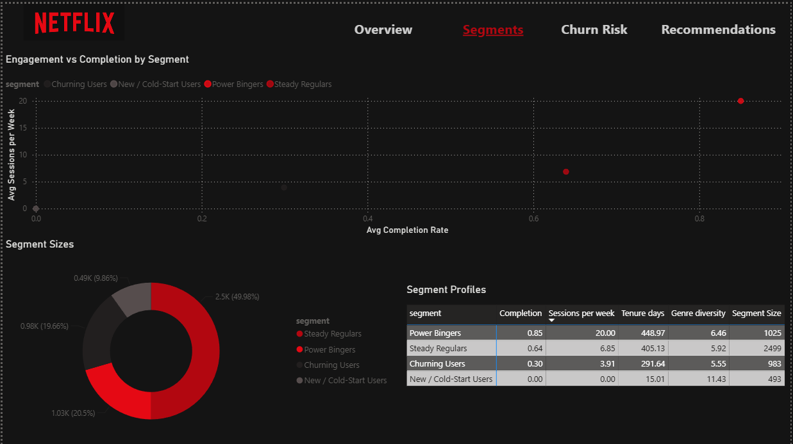
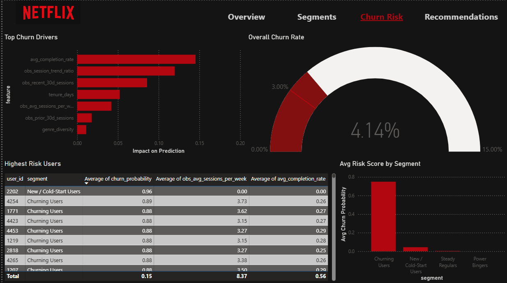
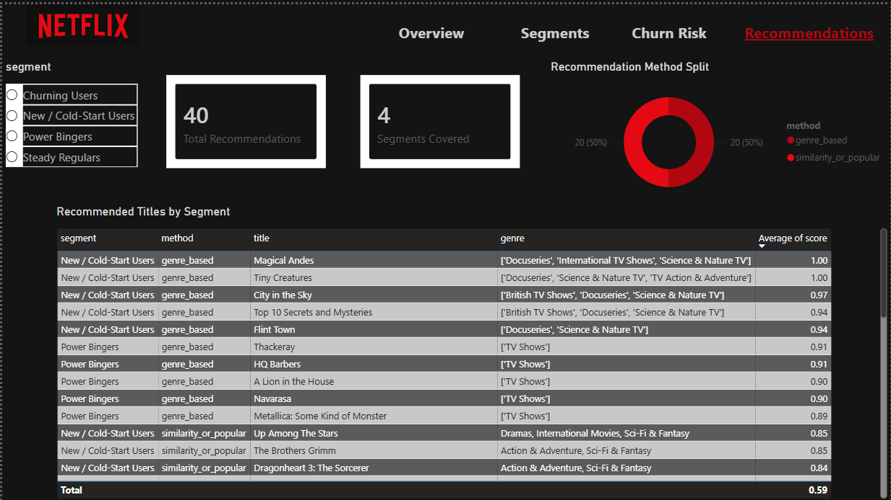

# Netflix Churn Analytics

An end to end data science project that simulates how a streaming platform (Netflix, Hotstar, JioCinema style) could identify subscribers at risk of churning, understand *why* they're at risk, and generate content recommendations to re engage them before they cancel.

**Live dashboards:**
- 🎬 **Streamlit app:** [netflix-churn-analytics.streamlit.app](https://netflix-churn-analytics-gjdgzspmhprmebipxyvqlk.streamlit.app/)
- 📊 **Power BI report:** see `dashboard/netflix.pbix` (screenshots below)

---

## The problem

Content teams at streaming platforms spend enormous budgets on licensing every quarter, but often lack predictive tools to answer a more fundamental question than "what's popular": **which subscribers are about to leave, and what content would bring them back?**

This project builds a full pipeline to answer that : segment → predict → explain → act.

## What it does

1. **Segments viewers** into behavioral groups (Power Bingers, Churning Users, Steady Regulars, New/Cold Start Users) using unsupervised clustering on viewing behavior.
2. **Predicts churn risk** per user with a supervised classifier, trained on 60 days of observed behavior to predict disengagement in the following 30 days.
3. **Explains every prediction** using SHAP values not just a risk score, but *why* a user is flagged.
4. **Recommends content** to re-engage each at-risk segment, using both genre-performance data and a TF-IDF content similarity model.
5. **Visualizes everything** in two parallel dashboards Power BI (business facing) and Streamlit (interactive, publicly deployable).

---

## Tech stack

| Layer | Tools |
|---|---|
| Data processing | Python, pandas, numpy |
| Machine learning | scikit learn (K Means, Random Forest), SHAP |
| Recommender | TF-IDF + cosine similarity (scikit-learn) |
| Visualization | matplotlib, seaborn, Plotly |
| Dashboards | Power BI Desktop, Streamlit |
| Data | [Netflix Movies and TV Shows (Kaggle)](https://www.kaggle.com/datasets/shivamb/netflix-shows) + synthetic viewing behavior generated for this project |

---

## Methodology

### Synthetic viewing behavior

Since no public dataset contains real Netflix viewing telemetry, this project generates realistic synthetic behavior for 5,000 users, each assigned one of five personas (Power Binger, Casual Viewer, Churning User, Weekend Watcher, New User). Behavior isn't sampled independently per field it's simulated as a **day by day session history** over a 90 day window, with persona-specific session frequency (Poisson), completion rate (Beta distribution), and genre preference (weighted sampling against the real Netflix catalog), so that downstream features like recency and trend emerge naturally rather than being hardcoded.

### Avoiding label leakage

The churn label (`churned_next_30d`) is defined by whether a user had *any* activity in the final 30 day window of their session history. Every model feature is computed **only from the preceding 60 day observation window** a strict temporal split that prevents any feature from encoding the same information as the label. (An earlier version of this pipeline didn't enforce this split and produced a suspicious 0.998 ROC-AUC; the corrected version scores a more realistic and genuinely predictive 0.93.)

### Viewer segmentation (K Means)

Users are clustered on five standardized behavioral features (session frequency, completion rate, recency, genre diversity, tenure) after testing k=2 through k=8 via silhouette score, which peaked decisively at **k=5**. Clusters are validated against the synthetic ground truth persona labels and given business meaningful names.

### Churn prediction (Random Forest)

A Random Forest classifier (`class_weight='balanced'`, given the realistic ~4% churn rate) predicts 30 day churn risk from observation-window features, evaluated with stratified train/test split, ROC-AUC, and a full precision/recall breakdown given the class imbalance.

### Explainability (SHAP)

SHAP TreeExplainer values identify completion rate and session trend as the two strongest churn predictors both global summary plots and individual per user force plot explanations are generated.

### Recommendation engine

Two complementary approaches: (1) genre based, surfacing the highest-completion titles within each segment's top performing genre, and (2) content based, TF-IDF vectors over title description + genre, ranked by cosine similarity to each segment's best performing seed title. A fallback to globally popular titles handles the cold start case (New Users have no watch history to personalize against).

---

## Repository structure

```
netflix-churn-analytics/
├── data/
│   ├── raw/                    # original Kaggle dataset
│   └── processed/              # cleaned + generated datasets, dashboard exports
├── notebooks/
│   ├── 01_eda.ipynb
│   ├── 02_viewer_segmentation.ipynb
│   ├── 03_churn_prediction.ipynb
│   └── 04_recommendation.ipynb
├── src/
│   ├── data_generator.py       # synthetic viewing behavior simulation
│   ├── interactions.py         # user-title interaction log builder
│   ├── segmentation.py         # K-Means clustering pipeline
│   ├── churn_model.py          # Random Forest + SHAP pipeline
│   └── recommender.py          # genre-based + TF-IDF recommenders
├── dashboard/
│   ├── app.py                  # Streamlit dashboard
│   └── netflix.pbix            # Power BI dashboard
├── reports/
├── requirements.txt
└── README.md
```

---

## Key results

- **~4.1% overall churn rate**, in line with realistic subscription business churn ranges
- **ROC-AUC 0.93** on held out test data, with recall prioritized (catches ~100% of true churners at the cost of some false positives, a deliberate tradeoff for a retention use case)
- **K-Means silhouette score 0.42 at k=5**, with near perfect cluster purity for Power Bingers and Churning Users
- Top churn drivers (via SHAP): completion rate, session trend ratio, recent activity level

---

## Dashboards

### Power BI


```markdown





```

### Streamlit (live demo)

**[Open the live app →](https://netflix-churn-analytics-gjdgzspmhprmebipxyvqlk.streamlit.app/)**

A publicly deployable, interactive companion to the Power BI report, built with Plotly for hover/zoom interactivity — same 5 page structure, same Netflix branded dark theme.

---

## Reproducing this project

```bash
# 1. Clone and set up environment
git clone https://github.com/namratacodes/netflix-churn-analytics.git
cd netflix-churn-analytics
python -m venv venv
venv\Scripts\activate          # Windows
pip install -r requirements.txt

# 2. Download the Kaggle dataset
# https://www.kaggle.com/datasets/shivamb/netflix-shows
# place netflix_titles.csv in data/raw/

# 3. Generate synthetic viewing behavior
python src/data_generator.py

# 4. Run notebooks in order
# 01_eda.ipynb -> 02_viewer_segmentation.ipynb ->
# 03_churn_prediction.ipynb -> 04_recommendation.ipynb

# 5. Run the Streamlit dashboard
streamlit run dashboard/app.py
```

---

## Limitations and honest notes

- Viewing behavior is **synthetic**, not real subscriber telemetry genre level completion patterns and churn drivers reflect the simulation's design, not verified real world Netflix behavior.
- **New/cold start users** have no observation window history by construction, which limits the churn model's ability to say anything meaningful about very recent sign ups the same limitation real production churn models face, typically addressed with a separate onboarding risk model.
- K Means does not fully separate Casual Viewers from Weekend Watchers, since their designed difference (genre timing/preference) wasn't included as a clustering feature a deliberate scope decision, documented rather than hidden.

---

## Author

Built by [namratacodes](https://github.com/namratacodes) 